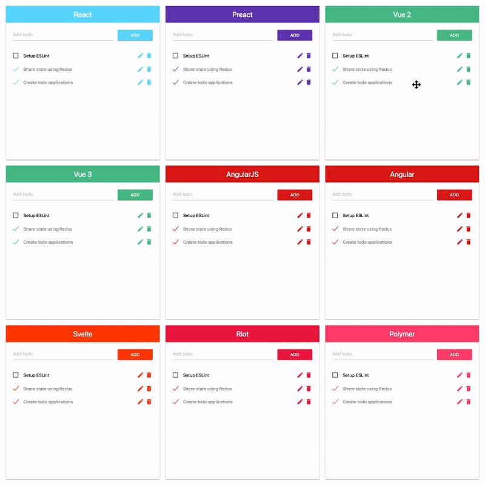

# Frontend Frameworks

The todo applications in multiple frontend frameworks with a sharing state using Redux.

Try it online at [https://p-siriphanthong.github.io/frontend-frameworks](https://p-siriphanthong.github.io/frontend-frameworks).

## The List of frontend frameworks

1. [React](https://reactjs.org)

2. [Preact](https://preactjs.com)

3. [Vue 2](https://vuejs.org)

4. [Vue 3](https://v3.vuejs.org)

5. [AngularJS](https://angularjs.org)

6. [Angular](https://angular.io)

7. [Svelte](https://svelte.dev)

8. [Riot](https://riot.js.org)

9. [Polymer](https://www.polymer-project.org)
